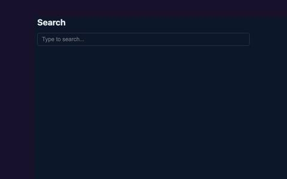
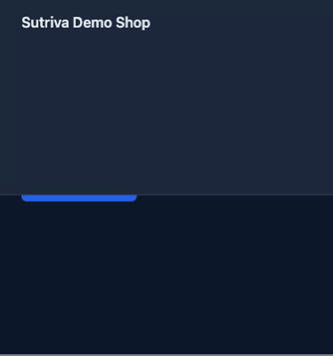

# Sutriva

> Temporal memory for coding agents.

**Sutriva gives coding agents temporal memory: a persistent, queryable record of what happened across a debugging session -- live or recorded -- that can be retrieved and correlated after the fact, instead of relying only on the current application state.**

> **Status: the full core system is built, tested, and release-hardened.** All 8 master-plan phases plus npm packaging, a real speech-to-text provider, and an automated agentic evaluation harness are done -- see [Limitations & roadmap](#limitations--roadmap) for exactly what's left (naming/publication decisions, not core capability).

**WHAT:** Sutriva gives coding agents temporal memory.
**WHY:** Debugging often depends on understanding what happened *before* the current state -- a click three steps back, a request that failed a minute ago, a console error that's since scrolled off screen.
**HOW:** Sutriva records and indexes live or recorded developer sessions as timestamped, confidence-scored evidence that Claude can query through MCP -- incrementally, never as a raw video dump.

## Why Sutriva exists

Claude Code can already read a repository, run commands, and -- via its own native browser integration (`--chrome`, "Claude in Chrome") -- observe and act in a live browser tab directly: screenshots, DOM/console inspection, clicking, navigating. Sutriva doesn't give Claude a capability it's missing there; positioning it that way would be inaccurate.

What Claude Code doesn't have is **memory of a session across time**: a persistent, timestamped, queryable record of what happened, correlated with Git state, retrievable later -- by this session or a different one -- instead of just the current moment. A bug someone reproduced in a screen recording, or reproduced live five minutes ago, is gone from working context once the conversation moves on. Dumping a whole video into a prompt doesn't fix this either -- it's expensive, unbounded, and impossible to ground in timestamps.

Sutriva is not a video summarizer, and it's not a substitute for Claude's own browser capability. It's a **temporal evidence layer**: every observation (a frame, a click, a console error, a network response) gets a timestamp, a confidence, and a link back to its source artifact, persisted the moment it happens. Claude queries this incrementally -- metadata, then a timeline, then a specific frame -- instead of receiving raw video, and can ask "what happened right before this" about a moment that's long since scrolled off screen, in a session that started before this conversation did.

See `docs/product.md` for the full product thesis and workflows, and `docs/competitive-analysis.md` for how this compares to video understanding APIs, video-analysis MCP servers, Claude Code's own native browser integration, and computer-use agents.

## Why Sutriva?

The name is inspired by the idea of a *sutra* -- a thread that connects things. Sutriva connects the events of a debugging session (screen, browser, network, console, terminal, Git, video, audio) across time into one structured, queryable record a coding agent can reason about.

## Architecture

```
MP4 --ffprobe/ffmpeg--> metadata + sampled frames --VisionProvider--> observations --,
                                                                                      |
Playwright browser --instrumentPage--> EventBus (publish/subscribe) ---------------->+
                                                                                      v
                                                          TemporalEvent + Evidence (SQLite)
                                                                                      |
                                                                                      v
                                                                    MCP tool surface
                                                                                      |
                                                                                      v
                                                                     Claude Code
```

**Packages** (`pnpm` workspace, no build step in dev -- everything runs via `tsx`; `apps/cli`/`apps/mcp-server` also build to a standalone bundle for external install, see [Installing outside this repo](#installing-outside-this-repo)):

| Package | Responsibility |
|---|---|
| `packages/core` | Domain types (`Session`, `TemporalEvent`, `Evidence`, `Artifact`), the `EventBus`, Zod schemas, actionable errors, path validation, config. |
| `packages/video` | FFmpeg wrapper: metadata probing, content hashing, frame/audio extraction, bounded sampling. |
| `packages/providers` | `VisionProvider`/`TranscriptionProvider` interfaces + mock (offline/deterministic) and real (`AnthropicVisionProvider`, `ElevenLabsTranscriptionProvider`) implementations. Provider SDKs never leak outside this package. |
| `packages/storage` | SQLite (`better-sqlite3`) persistence for sessions, events, evidence, artifacts, transcripts. |
| `packages/timeline` | Orchestrates ingest (`inspectVideo`) and query (`getTimeline`, `getFrame`, `searchSession`, `analyzeSegment`, `getEvidenceAround`, `getCurrentContext`, `compareSessions`). |
| `packages/git` | Minimal Git context (branch, commit, working-tree status, recent commits) for correlating evidence with source -- not a full diff/blame engine. |
| `packages/browser` | Playwright instrumentation: navigation, click, input, console, pageerror, request/response/requestfailed, screenshots. |
| `packages/live` | Orchestrates a live session -- launches a browser, instruments it, and persists every observation into the *same* sessions/events/evidence tables a replayed MP4 uses. |
| `apps/mcp-server` | MCP server exposing the tool surface below over stdio. |
| `apps/cli` | `sutriva` CLI -- useful standalone, without Claude Code. |

See `docs/architecture.md` for the full design rationale (progressive disclosure, content-hash caching, why live and replay share one event model).

## Quickstart

Requirements: Node.js **>= 22** (better-sqlite3's native binding requires it -- see [Provider configuration](#provider-configuration)), [FFmpeg](https://ffmpeg.org/) (`ffmpeg`/`ffprobe` on `PATH`), `pnpm`. Live browser debugging (`sutriva debug --live`) additionally needs Playwright's Chromium, which is **not** downloaded automatically by `npm`/`pnpm install` -- run `npx playwright install chromium` once; `sutriva doctor` checks for this and tells you if it's missing.

```bash
git clone https://github.com/rathodpratham15/TraceLens.git && cd TraceLens
nvm use            # picks up Node 22 via .nvmrc, if you use nvm
pnpm install
pnpm cli doctor     # checks ffmpeg/git/Node and prints the active vision provider
```

Generate the bundled synthetic fixtures (no binary assets are committed -- they're generated from `ffmpeg` test sources):

```bash
pnpm fixtures:generate
```

Try the pipeline directly, with no API key required:

```bash
pnpm cli inspect fixtures/videos/sample.mp4
pnpm cli timeline fixtures/videos/sample.mp4
pnpm cli search fixtures/videos/sample.mp4 "change"
pnpm cli analyze fixtures/videos/sample.mp4 --start 5 --end 7 --question "what changed"
```

`pnpm verify:clean-install` reproduces the whole above sequence -- plus `build`, `typecheck`, `lint`, and the full test suite -- against a fresh `git clone` of the repo in a temp directory, exactly as a new contributor or CI would experience it. Verified against Node 22.14.0 on macOS: install, doctor, fixtures, build, typecheck, lint, and 85/87 tests all pass clean from an empty clone (the remaining 2 auto-skip until eval video fixtures are generated -- see [Testing](#testing)).

Without `ANTHROPIC_API_KEY` set, Sutriva uses a deterministic **mock vision provider** (a byte-delta heuristic between sampled frames) so the whole pipeline -- and the test suite -- works offline. Set `ANTHROPIC_API_KEY` to get real scene descriptions from Claude; see [Provider configuration](#provider-configuration).

## Claude Code integration

This repo ships a project-level `.mcp.json`, so opening Claude Code here auto-discovers the Sutriva MCP server:

```bash
export ANTHROPIC_API_KEY=sk-...   # optional -- omit to use the mock provider
claude
```

```
> Use the Sutriva tools to inspect fixtures/videos/checkout-bug.mp4 and tell me
> what happens in it, with timestamps.
```

Claude will call `inspect_video`, then `get_timeline`, then `get_frame` for any moment it wants to see directly -- it does not receive the raw video file.

For the full debugging workflow (evidence → repo inspection → hypothesis → fix → verification) in one step, use the bundled slash command instead:

```
> /debug-video fixtures/videos/checkout-bug.mp4
```

See `docs/example-sessions.md` for real, captured tool output (CLI and MCP) against this exact fixture -- not a mockup -- if you want to see what Claude actually receives before running it yourself.

## Temporal rewind example

The specific capability this whole project exists for: asking about a moment that's already passed, after more has happened since. Once a session exists (from `inspect_video` or a live session below):

```
> What happened right around the 8-second mark, before anything else changed?
```

Claude calls `get_evidence(sessionId, aroundSeconds: 8, windowSeconds: 3)` and gets back only the evidence in that window -- not the whole timeline, and not whatever is happening "now" in a live session that's since moved on. `tests/integration/canonical-temporal-memory.test.ts` is the automated proof of this: a failure occurs, more unrelated events happen afterward, and a historical query still returns the correct pre-failure evidence while `get_current_context` correctly reflects the newer activity -- two distinct, correctly time-scoped views, neither overwriting the other.

## Live debugging

```bash
sutriva debug --live --url https://your-app.local
```

This opens a real, visible browser window. Interact with it normally -- click around, reproduce a bug -- and Sutriva captures navigation, clicks, input, console messages, network requests/responses/failures, and periodic screenshots into a live session, live, as they happen, persisted to SQLite the moment they occur. This is a different browser than Claude Code's own `--chrome` integration -- that one is for Claude to directly observe/act in a tab in the current turn; this one is for a human-driven repro to become a durable, queryable record Claude (this session or a later one) can rewind through afterward. Ask Claude Code (in another terminal, once the MCP server is connected) to follow along:

```
> Look at this -- what just happened? Use get_current_context.
```

`get_current_context` returns a compact, bounded snapshot (current screenshot, current URL, recent events, recent console errors, recent network failures, live Git state) without Claude having to poll the whole timeline. Press Ctrl+C in the `sutriva debug --live` terminal to end the session.

Run a command and record it into that same timeline (e.g. to capture the test run that reproduces a bug):

```bash
sutriva exec -- npm test
```

Output streams to your terminal exactly as if you'd run the command directly; a bounded, redacted copy (command, exit code, stdout/stderr) is recorded as a `terminal` event if a live session is active. Related events get linked automatically: a network request/error is linked back to the click that likely triggered it, purely by time proximity -- this is evidence for Claude to reason over, not a causality claim Sutriva itself makes.

## Verifying a fix

Reproduce the bug once (live or as a recording) to get a `sessionId`, patch the code, then reproduce the *same* interaction again to get a second `sessionId`, and ask Claude to close the loop:

```
> Compare the session before my fix to the one after -- did it work?
```

Claude calls `compare_sessions(beforeSessionId, afterSessionId)`, which reports concretely what changed -- e.g. `POST /api/checkout: 500 → 200`, or a console error that no longer appears -- rather than you or Claude eyeballing two timelines side by side. This is the "reproduce → compare" half of the observe→diagnose→patch→test→reproduce→compare agentic loop; `/debug-video`'s workflow (below) drives the whole thing.

## Flagship demo: the closed loop

`demo/buggy-app` is a small, deterministic Next.js app with three intentional bugs (an API schema
mismatch, an async race condition, a responsive visual regression -- see `demo/buggy-app/README.md`
for each bug's symptom, root cause, fix, and a screenshot):

<p>
  
  
  
</p>

The full story this project exists to demonstrate:

```
"Follow me while I reproduce this."
        ↓
Bug occurs.
        ↓
Sutriva captures the temporal evidence.
        ↓
Claude retrieves what happened before the failure (get_timeline / get_evidence).
        ↓
Claude correlates the evidence with source/Git (inspect_environment).
        ↓
Claude proposes a fix (a labeled hypothesis, not an assertion).
        ↓
Claude patches the code, runs tests/typecheck.
        ↓
The bug is reproduced again.
        ↓
compare_sessions shows the before/after evidence: the failure is gone.
```

**This isn't aspirational -- it's already been run for real, end to end, with a real Claude API call, no human in the loop:** `pnpm eval:agentic` (`sutriva eval --agentic`) drives exactly this loop headlessly against a disposable `git worktree` per bug. All three demo bugs have been verified this way:

| Bug | Code localization | Root-cause hypothesis | Before → after |
|---|---|---|---|
| Checkout schema mismatch | Correct file, first try | "the frontend reads `data.orderId`... a response schema mismatch" -- matches `rootCause` exactly | `compare_sessions`: 1 console error resolved, 0 new |
| Search race condition | Correct file, first try | "whichever fetch response resolves *last* overwrites state, regardless of which request was issued *last*" | `#results` flips from stale `["Cat food", ...]` to correct `["Cats (the musical)", ...]` |
| Responsive regression | Correct file, first try | "the header grows... but `.responsive-main`'s padding-top stayed fixed" | Button bounding box flips from overlapping the header to clear |

Exactly how each run was produced (so it's reproducible, not a one-off): `pnpm fixtures:eval:generate` records each bug's repro as a real Playwright interaction; the harness then creates an isolated `git worktree`, records a real **live** browser session against the unpatched app (the "before"), runs `claude -p "<the expanded /debug-video prompt>" --output-format json --permission-mode bypassPermissions` against that worktree with no human involved, rebuilds the now-patched app, records a second live session (the "after"), and grades all three columns above deterministically. See `docs/evaluation.md`'s "Agentic evaluation" section for the full mechanism, and `tests/eval/agentic-harness.ts` for the implementation. This is a genuinely separate, opt-in path (real API cost per run) -- not part of `pnpm test`/CI.

To reproduce the flagship workflow yourself, live, instead of via the harness:

```bash
pnpm --filter buggy-app dev   # http://localhost:4173
sutriva debug --live --url http://localhost:4173/checkout
```

```
> Follow me while I reproduce a bug in http://localhost:4173.
```

## Evaluation

```bash
pnpm fixtures:eval:generate   # records a real Playwright repro of each demo bug as an MP4
pnpm eval                     # or: sutriva eval
```

Measures Sutriva against the three demo bugs: temporal localization, evidence retrieval, and
context efficiency (sampled frames vs. every frame at native fps; a single targeted frame's size
vs. an estimated "send every frame" baseline) are fully automated and deterministic -- no paid API
calls. Root-cause accuracy, code localization, and patch success require an actual agent reading
the repository, so `pnpm eval` reports those with the exact `/debug-video` command to grade them by
hand rather than faked -- or run `pnpm eval:agentic` (`sutriva eval --agentic`) to automate that
grading too: it actually drives Claude Code headlessly against a disposable `git worktree` per
scenario and grades the result deterministically (code-diff overlap, keyword-overlap on root cause,
and a real before/after check -- `compare_sessions` where the bug produces a console/network
signal, a direct Playwright assertion where it doesn't). This is a separate, explicitly opt-in path
that costs a real API call per scenario (not run by `pnpm test`/CI). See `docs/evaluation.md` for
the full methodology, both harnesses, and an honest discussion of what each can and can't measure.

## MCP tools

| Tool | Purpose |
|---|---|
| `inspect_video` | Ingests a video into a session: metadata, sampled frames, vision analysis, transcript (if the video has audio), timeline. Reuses the existing session if the file's content hash was already seen. |
| `get_timeline` | Returns the bounded, timestamped event list for a session (supports `limit`/`afterSeconds`/`beforeSeconds`). Visual, audio, browser, and terminal events are all merged in time order, with `relatedEventIds` on events that were automatically correlated to a plausible preceding cause. |
| `get_frame` | Returns one targeted replay frame (as an image Claude can see) near a timestamp -- the model never has to re-request the whole video for a follow-up visual question. |
| `search_session` | Full-text search over a session's event descriptions. |
| `get_evidence` | Temporal rewind: evidence within a time window around a timestamp ("what happened immediately before/after this?"). |
| `analyze_segment` | Dense, on-demand analysis over a narrow time range -- for when the coarse timeline isn't enough detail. |
| `get_transcript` | Raw audio transcript segments for a session. |
| `inspect_environment` | Current Git context (branch/commit/status/recent commits/diffstat, plus the full working-tree diff if `includeDiff` is set), whether a live session is running, and capability flags for browser/network/console/terminal (each populated only while/if actually captured). |
| `get_current_context` | The "look at this" / "what just happened?" snapshot for a live session: screenshot, current URL, recent events/errors/failures, live Git state. Defaults to the active live session if `sessionId` is omitted. |
| `compare_sessions` | Before/after verification: diffs two sessions and reports endpoints whose status changed (e.g. 500 → 200) and console errors that appeared/disappeared -- the "reproduce and compare" step of the agentic loop. |

## Claude Code plugin command

`.claude/commands/debug-video.md` adds `/debug-video <path>` as a project-level slash command. It packages the full agent workflow from `TraceLens_Master_Plan.md` §25 (inspect → timeline → evidence → frames → repo → hypothesis → evidence-labeled confidence → patch → test → reproduce → report) so you don't have to spell it out by hand each time:

```
claude
> /debug-video fixtures/videos/checkout-bug.mp4
```

## CLI

```bash
sutriva doctor                                    # environment check
sutriva inspect <video>                           # ingest + build timeline
sutriva timeline <video> [--limit N] [--json]
sutriva search <video> "<query>"
sutriva analyze <video> --start S --end E [--question "..."]
sutriva debug --live [--url <url>] [--headless]   # live browser session (Ctrl+C to stop)
sutriva exec -- <command>                         # run + record a command into the active live session
sutriva session list
sutriva eval                                       # run the evaluation harness against demo/buggy-app
sutriva clean [--yes]                             # delete .sutriva/ (derived data only)
```

`sutriva debug <video>` explains how to drive replay debugging via Claude Code/MCP rather than duplicating that logic in the CLI. `sutriva session report` is stubbed with an explanatory message -- it lands in a later phase (session recording/reporting wasn't part of the master plan's core phases).

### Installing outside this repo

`apps/cli` and `apps/mcp-server` build to a single self-contained `dist/index.js` each (via `tsup`, inlining the internal `@sutriva/*` packages -- see `apps/cli/tsup.config.ts`), so they're installable independently of this monorepo:

```bash
pnpm --filter @sutriva/cli build && pnpm --filter @sutriva/cli pack
npm install -g ./sutriva-cli-0.1.0.tgz   # installs the `sutriva` binary
```

Same for `@sutriva/mcp-server` (`sutriva-mcp` binary), which any other repo's `.mcp.json` can point at once installed. Both packages are currently marked `private: true` and are **not published to the npm registry** -- this is a deliberate stop-short: the build/bundle/pack path is verified working end to end (built, packed, installed globally, and run from outside the repo with no workspace context), but actually publishing is a separate decision (package naming, a license, npm org ownership) left for later.

## Provider configuration

Sutriva never calls a model provider unless a tool that needs one is invoked, and never uploads anything automatically.

| Variable | Default | Purpose |
|---|---|---|
| `SUTRIVA_VISION_PROVIDER` | `anthropic` if `ANTHROPIC_API_KEY` is set, else `mock` | `mock` or `anthropic`. |
| `ANTHROPIC_API_KEY` | unset | Required for the `anthropic` provider. |
| `SUTRIVA_VISION_MODEL` | `claude-opus-5` | Any current vision-capable Claude model. |
| `SUTRIVA_TRANSCRIPTION_PROVIDER` | `elevenlabs` if `ELEVENLABS_API_KEY` is set, else `mock` | `mock` or `elevenlabs`. |
| `ELEVENLABS_API_KEY` | unset | Required for the `elevenlabs` (Scribe) transcription provider. |
| `SUTRIVA_TRANSCRIPTION_MODEL` | `scribe_v1` | Passed to ElevenLabs' Speech-to-Text API (`scribe_v1` or `scribe_v2`). |
| `SUTRIVA_DATA_DIR` | `./.sutriva` | Where sessions, timelines, and extracted frames are stored. |

`VisionProvider`/`TranscriptionProvider` are plain interfaces (`packages/providers/src/types.ts`); adding another provider means adding one file that implements one -- core/timeline code never imports a provider SDK directly.

## Privacy

Local-first by default: no telemetry, no automatic uploads. A frame only leaves your machine when a tool call explicitly invokes the `anthropic` vision provider. See `docs/privacy.md`.

## Testing

```bash
pnpm typecheck   # tsc --noEmit across every package/app
pnpm lint        # eslint
pnpm test        # vitest -- unit tests + a real MCP-server-over-stdio integration test
```

All 87 current tests run offline against the mock providers, generated fixtures, and a local HTTP test server for browser instrumentation -- no paid API calls or external network access are required to validate the system. The live-session tests run a real headless Chromium against a page deliberately designed to trigger a console error, a failed request, and a click, and assert the resulting events/evidence/screenshot/correlation; `compare_sessions` is tested against two real inspected videos through the actual MCP tool call; `tests/integration/canonical-temporal-memory.test.ts` proves the central thesis directly (historical retrieval survives later, unrelated events). The eval harness itself is tested too (`tests/eval/harness.test.ts`), skipped automatically if the eval video fixtures haven't been generated. (The agentic eval harness, `pnpm eval:agentic`, is a separate opt-in path that costs real API calls -- see [Flagship demo: the closed loop](#flagship-demo-the-closed-loop) -- so it's deliberately not part of this test count.)

## Limitations & roadmap

The core system (`TraceLens_Master_Plan.md`'s Phases 0-7) is complete, along with three post-plan additions: npm packaging, a real speech-to-text provider, and an automated agentic evaluation harness. Real, permanent limitations worth knowing before you rely on this:

- **No visual diffing in `compare_sessions`.** It compares console errors and network endpoint status codes only -- it has no way to detect a purely visual/layout regression (like the demo's `responsive-regression` bug) with no console or network signal. The agentic eval harness works around this for its own grading with a direct, scenario-specific Playwright assertion (a DOM/bounding-box check), not by extending `compare_sessions` itself. If your bug has no console error and no failing request, `compare_sessions` will honestly report "nothing changed" even after a real fix -- verify visually instead.
- `compare_sessions` also matches endpoints by exact `METHOD URL` string and parses status from the stored event description -- it doesn't normalize URLs (query strings, path params) or diff response bodies, so two calls to what's logically "the same" endpoint with different query strings are treated as different endpoints.
- **Event correlation (`relatedEventIds`) is a bounded, time-proximity heuristic**, not causal analysis (network follows a recent interaction; a console error follows a recent network event). It links plausible chains, never asserts one event caused another.
- **Model API costs are real and not free.** `ANTHROPIC_API_KEY` (vision) and `ELEVENLABS_API_KEY` (transcription) both make real, billed API calls the moment a tool that needs them is invoked -- see [Privacy](#privacy) for exactly when. `pnpm eval:agentic` costs roughly $0.50-$1 per scenario per run (a real Claude API call driving an actual patch).
- **Live browser debugging needs Playwright's Chromium installed separately** (`npx playwright install chromium`) -- `npm`/`pnpm install` does not fetch it automatically (Playwright's own package has no postinstall download step), and `sutriva doctor` checks for and reports this explicitly rather than letting it fail opaquely later.
- Live-session screenshots are best-effort: an occasional capture immediately after a navigation can transiently fail in headless Chromium (a known Playwright quirk); it's logged and skipped rather than crashing the session.
- Terminal capture requires explicitly running commands through `sutriva exec`; there's no shell-wide/automatic capture of arbitrary commands you type directly. Redaction (`redactSecrets`) is a best-effort heuristic (common `KEY=value`/Bearer-token/AWS-key/PEM patterns), not a guarantee -- treat captured terminal output as potentially sensitive regardless.
- Click/input capture describes the target element (tag/id/class/text), not a full DOM diff -- deliberate, not a gap.
- **Platform:** developed and tested on macOS (Apple Silicon) only. `better-sqlite3`'s native binding, Playwright's Chromium download, and `ffmpeg`/`ffprobe` are all platform-specific binaries -- Linux/Windows should work in principle (all three support those platforms upstream) but haven't been verified here.
- **Not yet published to npm.** The build/bundle/pack path is verified working end to end (see [Installing outside this repo](#installing-outside-this-repo)), but the package name is still under review (the obvious names are already taken by unrelated projects on the registry) and actual `npm publish` hasn't happened.
- `sutriva session report` is stubbed with an explanatory message, not implemented -- session recording/reporting as a distinct artifact wasn't part of the master plan's core phases.
