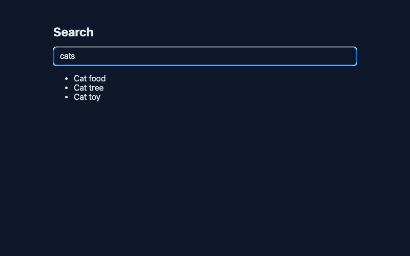
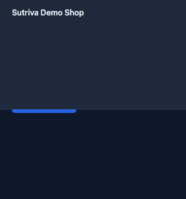

# buggy-app

A small, deterministic Next.js app with three intentional bugs, used to demo and benchmark
Sutriva (`docs/evaluation.md`, `tests/eval/`). Every bug is designed to reproduce identically
every run -- no flaky timing, no real network dependency.

```bash
pnpm --filter buggy-app dev   # http://localhost:4173
```

## Bug 1 -- API response mismatch (`/checkout`)

**Symptom:** clicking "Place order" throws `Cannot read properties of undefined (reading 'toString')`
in the console; no confirmation is shown.

**Root cause:** `app/api/checkout/route.ts` returns `{ id, total }`, but `app/checkout/page.tsx`
reads `data.orderId` (which doesn't exist).

**Reproduce:** go to `/checkout`, click "Place order".

**Fix:** change `app/checkout/page.tsx`'s `data.orderId` to `data.id` (or change the API to return
`orderId` instead of `id` -- either side can adapt to the other; this repo's canonical fix is the
frontend, since `expectedFiles` in the eval scenario names `app/checkout/page.tsx`).


The button never leaves "Processing..." because the click handler throws before `setStatus("done")`
runs -- the console (not visible in a static screenshot) shows the exact evidence Sutriva
captures: `TypeError: Cannot read properties of undefined (reading 'toString')`.

## Bug 2 -- async race condition (`/search`)

**Symptom:** typing "cat" then quickly "cats" ends up showing results for "cat" ("Cat food, Cat
tree, Cat toy") even though "cats" is what's currently in the input.

**Root cause:** `app/api/search/route.ts` has a deterministic, query-dependent delay ("cat" takes
800ms, "cats" takes 100ms) so the "cats" response reliably arrives *before* the "cat" response.
`app/search/page.tsx` has no request-sequencing guard, so whichever response arrives *last* wins,
even though it was requested *first* and is now stale.

**Reproduce:** go to `/search`, type "cat", then within ~150ms type an "s" to make it "cats".

**Fix:** guard against out-of-order responses in `app/search/page.tsx` -- e.g. track a request
sequence number (or an `AbortController` per keystroke) and ignore a response if a newer request
has already started.



The input reads "cats", but the results ("Cat food", "Cat tree", "Cat toy") are the stale response
to the earlier "cat" request, which arrived after the "cats" response.

## Bug 3 -- responsive visual regression (`/responsive`)

**Symptom:** at viewport widths <= 480px, the "Submit order" button is hidden underneath the
fixed header (unclickable). At normal desktop widths, it's fine.

**Root cause:** `app/responsive/responsive.css`'s mobile media query grows `.app-header` from 64px
to 220px tall (simulating it wrapping to multiple lines), but `.responsive-main`'s `padding-top`
is never increased to compensate, so the header now overlaps content that assumed a 64px header.

**Reproduce:** open `/responsive` with the viewport set to <= 480px wide (e.g. Playwright
`newPage({ viewport: { width: 375, height: 667 } })`, or a phone-sized browser window).

**Fix:** add a matching `padding-top` increase for `.responsive-main` inside the same
`@media (max-width: 480px)` block in `app/responsive/responsive.css`.



At 375px wide, `.app-header` has grown tall enough to cover the top of "Submit order" -- no
console error, no failed request, only a visual/screenshot difference.

## Why these three specifically

They match the three categories from `TraceLens_Master_Plan.md` §28, and are deliberately
*not* network-level failures the way the earlier `checkout-bug.mp4` synthetic fixture is (a 500
error) -- these are a schema mismatch (still throws, but the request itself succeeds), a timing
bug (nothing "fails", the data is just stale), and a pure-CSS visual bug (no error at all, no
network activity) -- exercising different parts of what Sutriva can observe (console errors,
network response bodies/timing, and visual/screenshot evidence respectively).

## Regenerating the screenshots

The screenshots above are committed (unlike `fixtures/videos/**/*.mp4`, which are gitignored and
regenerated on demand) since they're documentation, not test input -- the README should render
without anyone running a script first. Regenerate them after changing a bug's UI:

```bash
pnpm screenshots:generate
```
