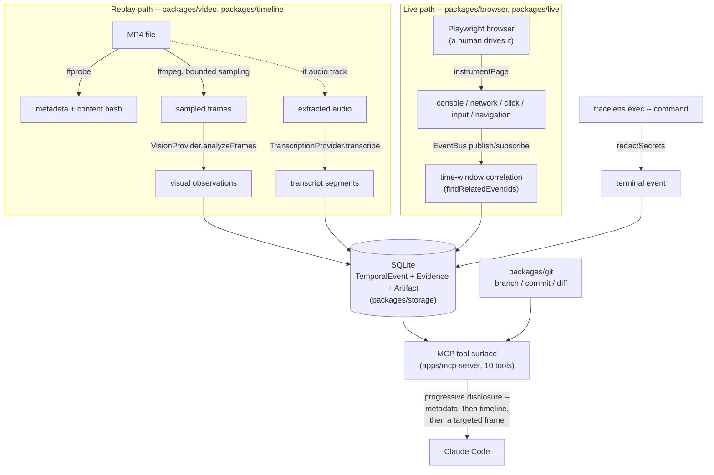

# Architecture

This describes the system as implemented (Phase 0 through Phase 6 -- the master plan's core phases are complete). For the full target architecture see `TraceLens_Master_Plan.md`.

## Diagram

Both entry points -- an ingested video and a live browser session -- normalize into the same `TemporalEvent`/`Evidence` tables before Claude ever sees them. Nothing downstream of SQLite knows or cares which path produced a given event.

Progressive disclosure (below) governs the MCP arrow above: Claude never receives everything in `Store` at once, and never receives the source video or a raw browser event stream directly.

## The temporal model

Everything TraceLens observes is normalized into two shapes, defined once in `packages/core/src/types.ts`:

- **`TemporalEvent`** -- a timestamped, typed observation (`visual`, `audio`, `interaction`, `network`, `console`, `dom`, `terminal`, `git`, `system`) with a description, an optional confidence, and a `source` pointing back to what produced it. Visual events (from sampled frames) and audio events (from transcript segments) are stored in the same table and interleaved by timestamp -- `get_timeline` doesn't distinguish them structurally.
- **`Evidence`** -- a grounded observation backed by a stored `Artifact` (a frame image or the session's extracted audio track). Evidence exists so a hypothesis can point at something concrete ("this frame, this confidence") rather than a free-text claim.

A `Session` owns a set of `sources` (`{kind: "video", reference: <path>}` for replay, `{kind: "browser", reference: <url>}` for live) and has a `mode`: `replay` for an ingested MP4, `live` for a running browser session; `recorded` is reserved for a future persisted-live-session view (§20). **The important design commitment is that live and replay sessions produce the same `TemporalEvent`/`Evidence` shapes** -- Claude's queries (`get_timeline`, `get_evidence`, `get_frame`, `search_session`) don't change based on where a session came from. `packages/live` is the only thing that knows the difference; everything downstream of the SQLite tables doesn't.

## Progressive disclosure

Claude never receives a whole video. The path is:

1. `inspect_video` -- metadata + a bounded number of sampled frames (`packages/video/src/sampling.ts` caps this at 24 by default, widening the interval rather than the frame count as duration grows) get analyzed once and turned into a timeline. The response is metadata + an event count, not the events themselves.
2. `get_timeline` / `search_session` -- the compact, timestamped event list (visual + audio merged), boundable by time range/`limit`, or filtered by a text query.
3. `get_frame` -- one targeted frame near a timestamp Claude cares about, returned as an actual MCP image content block (this is the one place raw bytes are appropriate -- it's a single small image, not the source video). `get_evidence` is the same idea for text: a bounded window of evidence around a timestamp, for "what happened right before/after this?".
4. `analyze_segment` -- dense on-demand re-sampling in a narrow window plus a provider call, for when the coarse timeline isn't enough. More expensive than the above, so it's scoped to a caller-chosen range rather than run automatically.
5. `get_transcript` -- raw audio transcript segments, when the video has an audio track and a transcription provider is configured.

This mirrors the plan's Level 0-4 disclosure model (`TraceLens_Master_Plan.md` §12).

## Content-hash caching

`inspectVideo` (`packages/timeline/src/ingest.ts`) hashes the file (streaming SHA-256, `packages/video/src/hash.ts`) before doing any work. If that hash has a session already (`video_sessions` table), the existing session is returned immediately -- no re-extraction, no re-analysis, no repeat provider calls. `get_frame` similarly reuses a previously extracted frame artifact if one exists within 0.4s of the requested timestamp instead of re-invoking ffmpeg.

## Provider abstraction

`packages/providers/src/types.ts` defines `VisionProvider` (`analyzeFrames`, `analyzeSegment`) and `TranscriptionProvider` (`transcribe`). Implementations:

- `MockVisionProvider` -- deterministic, offline, no network calls. Uses a frame-size-delta heuristic as a stand-in scene-change signal. This is the default provider and what the test suite runs against, so the whole system is testable without a paid API key.
- `AnthropicVisionProvider` -- sends sampled frames as base64 images to the Anthropic Messages API (`@anthropic-ai/sdk`), asks for strict JSON, and validates the response with Zod before trusting it (`malformedProviderResponseError` if it doesn't parse/validate).
- `MockTranscriptionProvider` -- deterministic, offline, default when `OPENAI_API_KEY` is unset. Derives a segment count from the extracted audio file's size and returns placeholder text, not real transcription -- what the test suite runs against.
- `OpenAIWhisperTranscriptionProvider` -- sends the extracted `audio.wav` to OpenAI's Audio API (`whisper-1`, `response_format: "verbose_json"`) and maps its `segments` (start/end/text) directly onto `Transcript`; `avg_logprob` (a log-probability, not 0-1) is clamped into TraceLens's 0-1 confidence range. `whisper-1` specifically, not a newer `gpt-4o-transcribe` model, because it's the one that reliably returns per-segment timestamps -- a transcript with no timing is useless for temporal rewind. `createTranscriptionProvider` (`packages/providers/src/factory.ts`) throws a clear error for any other `TRACELENS_TRANSCRIPTION_PROVIDER` value rather than silently doing nothing.

`packages/timeline` and `packages/storage` never import `@anthropic-ai/sdk` or `openai` -- only `packages/providers` does. Swapping in another multimodal or speech-to-text provider means adding one file there and one branch in the corresponding factory function.

## Storage

SQLite via `better-sqlite3` (`packages/storage`). Tables: `sessions`, `temporal_events`, `evidence`, `artifacts`, `transcript_segments`, and `video_sessions` (content-hash -> session index). No ORM -- `TraceLensStore` is a thin, fully-typed repository. This is intentionally not Postgres/Redis/Kafka: the plan is explicit that SQLite is sufficient until a real requirement emerges (§21, §36).

**Node version note:** `better-sqlite3` (current major) requires Node >= 22 for its N-API surface; older Node versions load the native binding but segfault on first use rather than raising a JS error. A `.nvmrc` pinning `22` is committed for this reason.

## MCP server

`apps/mcp-server` uses `@modelcontextprotocol/sdk`'s `McpServer` + `StdioServerTransport`. Each tool (`apps/mcp-server/src/tools.ts`) has a Zod input schema, a bounded/JSON-serializable text response (or an image content block for `get_frame`), and returns `isError: true` with an actionable message (via `TraceLensError`) rather than throwing an unstructured exception across the protocol boundary.

## Repository correlation (Git)

`packages/git` shells out to the `git` CLI (no library dependency) for the minimum context a debugging hypothesis needs: current branch, commit, working-tree dirty status, changed file paths, recent commits, and (added in Phase 4) a diff. `getGitContext` returns `{ isRepo: false }` rather than throwing when `cwd` isn't inside a Git working tree -- environment inspection should degrade gracefully, not fail the whole tool call. `getDiffStat` (`git diff --stat`, always cheap) and `getWorkingTreeDiff` (`git diff HEAD`, bounded to `maxLines` -- default 200 -- with a `truncated` flag) are kept separate from `getGitContext` since a full diff can be large; `inspect_environment` always includes the diffstat but only fetches the full diff when the caller passes `includeDiff: true`, matching the progressive-disclosure principle used everywhere else in the tool surface. This is deliberately *not* blame or full-history correlation -- just enough for a hypothesis to point at an actual line of changed code, not merely a file name.

`inspect_environment` (the MCP tool) wraps this Git context together with whether a live session is currently running, and capability flags for browser/network/console/terminal (`available: true` for all four, but each only actually populated while a live session is running -- or, for terminal, only for commands run through `tracelens exec`). The intent (`TraceLens_Master_Plan.md` §37: "never trust unvalidated model output", and the broader "don't fake the workflow" instruction) is that Claude is never left to assume silence means "nothing happening" for a source that isn't currently populated.

## Live sessions (browser)

`packages/browser` wraps Playwright: `instrumentPage` attaches listeners for the plan's prioritized event set (§21) -- `console`, `pageerror`, `request`, `response`, `requestfailed`, `framenavigated` -- plus a small injected script (`page.addInitScript` + `page.exposeFunction`) that reports real `click`/`input` DOM events back to Node. Deliberately no DOM diffing: an interaction is described by its target element (tag/id/class/truncated text), not a structural diff. Input values are captured truncated to 80 chars, redacted entirely for password fields (`el.type === "password"`).

`packages/live`'s `startLiveSession` is the orchestrator: it creates a `mode: "live"` `Session`, launches a browser, and wires an `EventBus` (`packages/core/src/event-bus.ts`, the literal `publish`/`subscribe` interface from §16) with three subscribers -- persist to SQLite as an `Evidence`-backed `TemporalEvent` (confidence `1`, since a console message or network response is a directly observed fact, not an inference), print a compact line for the live CLI feed, and trigger a screenshot capture on navigation/interaction events (plus a periodic fallback timer). Every event is stored the moment it happens -- there's no batching -- so a separate process (the MCP server, queried by Claude) can read a live session's state concurrently via SQLite's WAL mode while the CLI process is still writing to it.

`get_current_context` (`packages/timeline/src/live-context.ts`, the plan's §10/§18 "look at this" operation) auto-discovers "whichever live session is currently running" via `store.findActiveLiveSession()` if no `sessionId` is given, then returns a bounded snapshot: the most recent screenshot artifact, the last navigation's URL, the last 15 events, and the last 5 console-errors/network-failures found by scanning a 100-event lookback window. Git context is re-fetched live (not just the session-start snapshot) so commits made *during* a live debugging session show up.

**A real reliability bug found while testing this end-to-end:** Playwright's `chromium.launch()` defaults to `handleSIGINT: true` (and SIGTERM/SIGHUP), meaning Playwright installs its own process-level signal handler that closes the browser and lets the process die immediately on Ctrl+C -- racing against, and beating, `packages/live`'s own graceful shutdown (which needs to persist the final session state and print a summary first). `startLiveSession` now launches with `handleSIGINT/SIGTERM/SIGHUP: false` so the CLI's own shutdown handler has exclusive control. A related fix: the CLI's shutdown path avoids `process.exit()` on the normal path (it can truncate pending stdout writes) and races `stop()` against a 5s timeout with a forced exit only as a last resort, in case the browser process died in some other way mid-close.

## Terminal instrumentation

`packages/live/terminal.ts`'s `runAndCapture` (§22) spawns a command with `stdio: ["inherit", "pipe", "pipe"]`: stdin is inherited so interactive commands still work, and stdout/stderr are piped so they can be *tee'd* -- streamed to the caller's real terminal unmodified while a bounded, separate copy is captured for persistence. If a live session is active (or an explicit `sessionId` is given), the command becomes a `terminal`-typed `TemporalEvent`/`Evidence` (confidence 1: exit code and captured output are directly observed facts). If no session is active, the command still runs normally -- nothing is persisted, and the caller isn't required to have a session running just to use `tracelens exec` as a plain command runner.

Both the captured stdout/stderr *and* the command line itself are passed through `redactSecrets` (`packages/core/src/redact.ts`) before being stored -- a heuristic pass for common secret shapes (`KEY=value` assignments with secret-looking names, `Bearer <token>`, AWS access key IDs, PEM private key blocks). This is explicitly a best-effort heuristic per the plan's "do not capture secrets intentionally, provide redaction hooks" (§22), not a guarantee -- treat captured terminal output as potentially sensitive regardless. (A test written against this surfaced a real gap: the command line itself wasn't being redacted, only the output -- fixed, since arguments carry secrets just as easily, e.g. a `curl -H "Authorization: Bearer <token>"` invocation.)

## Evidence correlation

`packages/live/correlate.ts`'s `findRelatedEventIds` is the MVP version of the plan's evidence-correlation graph (§24) -- "SQLite relations are sufficient," so this populates the `relatedEventIds` array already defined on `TemporalEvent` rather than building a separate graph structure. It's a pure, time-window heuristic: a `network` event looks back for the most recent `interaction` event within 3s (a click that plausibly triggered this request); a `console` event matching `/error|exception/i` looks back for the most recent `network` event within 3s (an error that plausibly followed a failed request). `startLiveSession` wires this into the persist path via a small in-memory ring buffer (last 20 events) -- checked before each new event is stored. `get_timeline`/`search_session` include `relatedEventIds` in their output (omitted when empty, to stay compact).

This deliberately reconstructs only the first few links of the plan's example chain (click → request → failed response → console error → UI failure → source → commit) -- the "source function" and "Git commit" links are left to Claude actually reading code and calling `inspect_environment`, not pre-computed, because the plan is explicit that TraceLens should never automatically claim causality (§23/§27). A correlation here means "this happened shortly before, and its type suggests it's plausibly related" -- it is evidence for Claude's own observed/likely/possible reasoning, not a causality claim TraceLens makes itself.

## Agentic loop: before/after verification

`packages/timeline/src/compare.ts`'s `compareSessions(beforeId, afterId)` is the "reproduce → compare" half of the plan's observe→diagnose→patch→test→reproduce→compare loop (§26/§27) -- the rest of the loop (observe/diagnose/patch/test) doesn't need new TraceLens infrastructure, since it's Claude using tools it already has (Read/Grep, Edit, Bash) informed by the evidence tools from earlier phases. `compareSessions` works generically over any two sessions' stored event descriptions (not live-session-specific, so it applies to two replay recordings too): it parses network response descriptions (`"METHOD URL -> STATUS"`) to build a last-status-per-endpoint map for each session, diffs them to find endpoints that went from failing (>=400) to succeeding or vice versa, and separately diffs the set of distinct console-error messages seen in each. Like event correlation, this explicitly does not claim the code change *caused* the observed difference -- it surfaces the before/after evidence side by side and leaves the causal claim to Claude.

## Claude Code plugin command

`.claude/commands/debug-video.md` is a project-level slash command (not a distributed plugin -- `.claude/commands/*.md` is the idiomatic choice for a single-repo command; a full `.claude-plugin/` manifest is for sharing across repos/teams, which isn't a current requirement). Its body encodes the 14-step agent workflow from `TraceLens_Master_Plan.md` §25 as a prompt template, including the observed/likely/possible/confirmed confidence language from §23/§27 -- so evidence and inference stay explicitly separated in the final report rather than relying on whoever's typing the request that day to spell out the whole workflow. Step 13 (reproduce/verify) calls for `compare_sessions` explicitly rather than "compare the timelines" vaguely, and a "Live debugging" section covers the same workflow when the input is `tracelens debug --live` + `tracelens exec` rather than a recording.

## Demo app and evaluation

`demo/buggy-app` is a minimal Next.js (App Router) workspace package with three bugs matching the plan's §28 categories -- deliberately *not* another network-500 fixture like the earlier synthetic `checkout-bug.mp4`, so the demo exercises different evidence types: a schema mismatch (console `TypeError`, no network failure), an async race (stale UI state, no error at all), and a CSS visual regression (no error, no network activity -- only screenshot evidence). `scripts/generate-eval-fixtures.ts` builds and starts the app, then drives each bug's deterministic repro with Playwright, using `recordVideo` to capture a real MP4 per scenario (not a manual screen recording).

`tests/eval/harness.ts` (invoked by both `pnpm eval` and `tracelens eval`) is deliberately split from `tests/eval/run-eval.ts`, a two-line entry point that just calls `harness.ts`'s `main()`. Earlier, `run-eval.ts` tried to detect "am I being run directly" via `import.meta.url === file://${process.argv[1]}`, which matched when invoked through a package script but silently never matched when the same `tsx` binary was spawned directly as a child process (as `apps/cli/src/commands/eval.ts` does) -- `tracelens eval` exited 0 with no output and no report. Splitting the module removes the need for that detection entirely: the harness never self-invokes, so importing it for tests (`tests/eval/harness.test.ts`) is safe, and the thin entry point unconditionally runs `main()` no matter how it's invoked.

The harness measures four things without a paid model API call (temporal localization, evidence retrieval, context efficiency, latency -- see `docs/evaluation.md` for exact definitions) and reports root-cause accuracy/code localization/patch success as "manual," with the exact `/debug-video` invocation needed to grade them by hand. This mirrors the plan's own instruction not to make normal tests/benchmarks depend on paid APIs, while still being honest that some of what the plan asks to measure (§29) genuinely requires an agent to reason about source code, which is not something a deterministic script can fake.

## Errors

`packages/core/src/errors.ts` centralizes actionable errors (`missingFfmpegError`, `invalidVideoError`, `pathNotAllowedError`, `providerNotConfiguredError`, `malformedProviderResponseError`, `sessionNotFoundError`) so both the CLI and the MCP tool layer surface the same, install-instruction-bearing messages instead of raw stack traces.

## What's deliberately not built yet

The core system the master plan describes (Phases 0-6) is complete, and a real speech-to-text provider (`OpenAIWhisperTranscriptionProvider`) now exists too -- see the README's Limitations section for what's still open (it hasn't been exercised against a live API call in this environment, only unit-tested).
